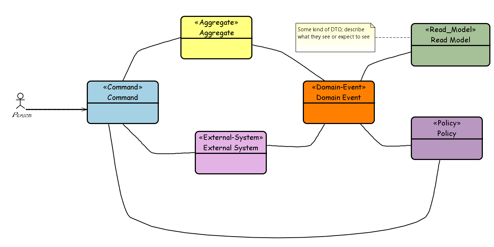

Event storming is a workshop-based method to quickly find out what is happening in the domain of a software program. It is extremely lightweight and requires intentionally no support by a computer. The result is expressed in sticky notes on a wide wall. The business process is "stormed out" as a series of domain events which are denoted as orange stickies. Basic idea is to bring together software developers and domain experts and learn from each other. 

* *Domain Event*: A `Domain Event` is something meaningful happened in the domain. The name of the event should be in the past tense.
* *Command*: Commands represent user action that causes `Domains Event`. Commands always have a name in its imperative form, for example 'create order'. Commands mutate the state of a system and result in one or more domain events.
* *Aggregate*: the Aggregate is the portion of the system that receives `Commands` and decides whether to execute them or not, thus producing a `Domain Event`.
* *Read Model*: Well defined set of information to be displayed to the user. 